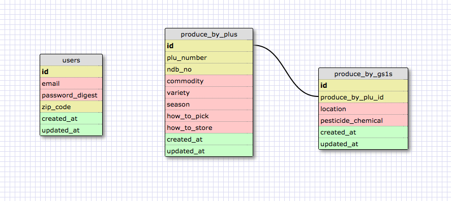

Missing Label - Backend
===========

App:
[Heroku App](https://missinglabel.herokuapp.com/)

Under the Hood
===========

Rails API
===========

Our current Rails API obtains nutrition data from the USDA. The farm locations are represented as a response from the Google maps API. Additional food data has been mocked to represent expected available data from GS1 in 2015. We have contacted representatives from GS1 to ensure the format of this expected information in order to create an app that would accomodate a simple transition to live data.

[Frontend repo](https://github.com/MissingLabel/missingapp)
